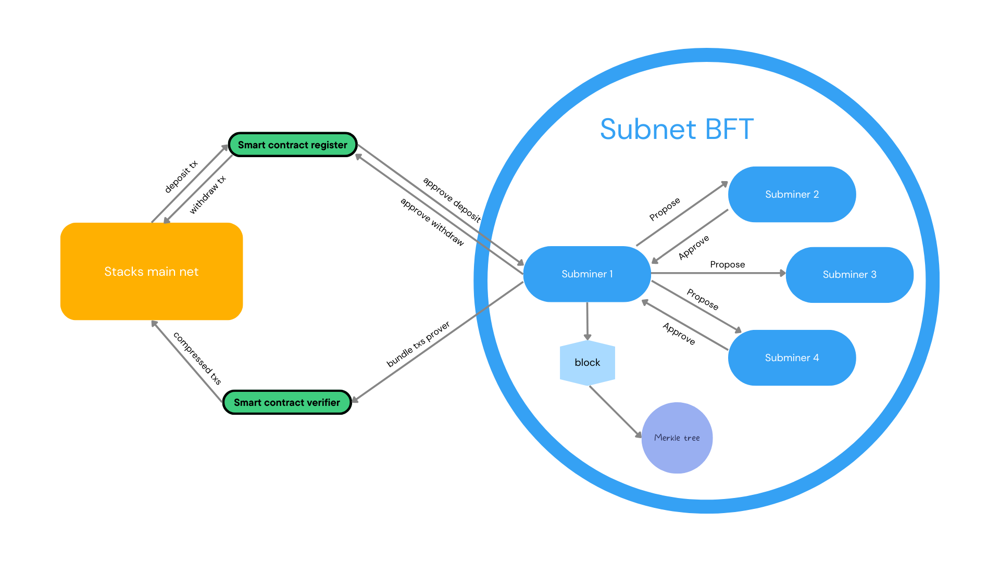

# zkStacks
## a private scalable Stacks layer2 subnet
***

zkStacks is a subnet designed to use ZK-STARK to ensure decentralization and privacy 
to follow Byzantine Fault Tolerant consensus rules.

A subnet is a secondary network to scale the overall Stacks network. 
Each node has its own Virtual Machine (Clarity VM) to ensure transaction validity
in consensus rules independent of the mainnet.

Subminer bundles transactions and updates merkle tree, proposing the block to other parties,
at least 67% are required to approve the proposal for adding new block to the chain

Transactions reflect the merkle root hash, following merkle proofs are propagated to a smart contract at the mainnet
which verifies the merkle root hash and ensures transactions existence.

